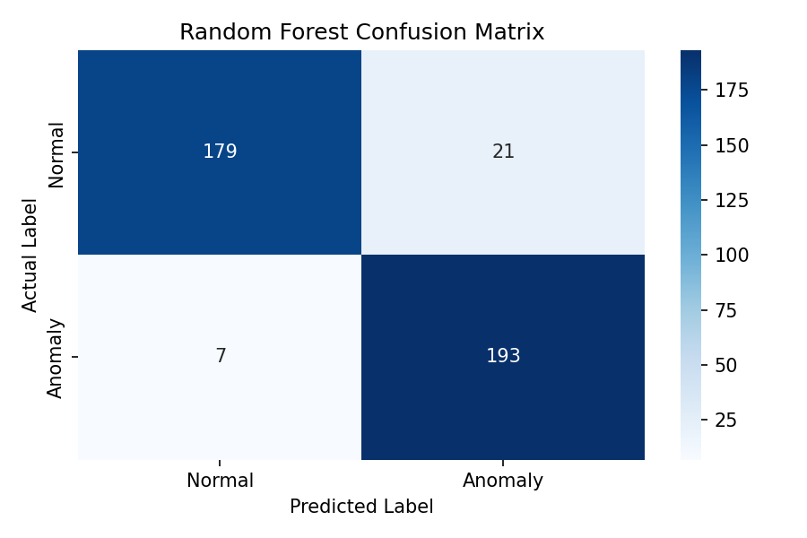
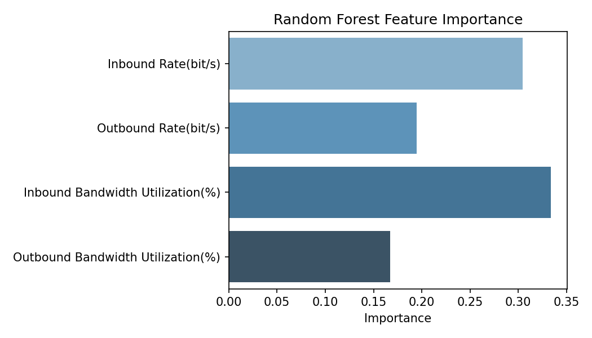
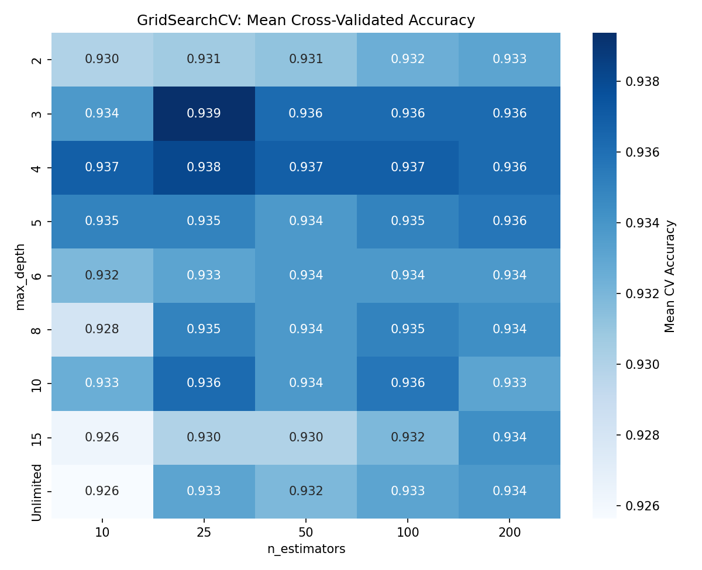
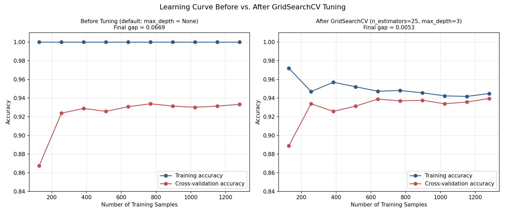

# Network Traffic Anomaly Detection Using Random Forest

A machine learning project that classifies network traffic as **Normal** or **Anomalous** using a Random Forest classifier, developed for CCE105 (University of Mindanao, College of Computing Education).

**Live demo:** [Insert Streamlit Cloud link here once deployed]

## Overview

Network traffic can show unusual patterns that indicate suspicious or abnormal activity. This project trains a supervised machine learning model to automatically classify traffic records as normal or anomalous based on four traffic measurements, instead of relying on manually defined rules.

## Dataset

- **Source:** [Network Anomaly Dataset on Kaggle](https://www.kaggle.com/datasets/amineipad/network-anoamly-dataset) (1,654 records), expanded to 2,000 records (1,000 Normal / 1,000 Anomaly) via class-wise synthetic augmentation to meet a required minimum sample size per class.
- **Features:**
  - `Inbound Rate(bit/s)`
  - `Outbound Rate(bit/s)`
  - `Inbound Bandwidth Utilization(%)`
  - `Outbound Bandwidth Utilization(%)`
- **Target:** `Label` (0 = Normal, 1 = Anomaly)

## Model

- **Algorithm:** Random Forest Classifier (scikit-learn)
- **Baseline:** 100 estimators, unrestricted depth
- **Tuned (via GridSearchCV, 5-fold CV, 45 combinations searched):** 25 estimators, max_depth = 3

## Results

| Metric | Baseline | Tuned |
|---|---|---|
| Accuracy | 93.00% | **94.00%** |
| Precision | 90.19% | 89.64% |
| Recall | 96.50% | **99.50%** |
| F1-Score | 93.24% | **94.31%** |
| Train/CV Gap (overfitting check) | 6.69% | **0.53%** |

The baseline model showed mild overfitting (training accuracy ~99% vs. cross-validation accuracy ~93%). GridSearchCV tuning of `n_estimators` and `max_depth` closed this gap substantially while also improving recall — the tuned model misses only 1 anomalous record out of 200, compared to 7 missed by the baseline.






## How to Run the Analysis

1. Clone this repository or download the files.
2. Install dependencies:
   ```
   pip install -r requirements.txt
   ```
3. Run the script:
   ```
   python network_traffic_anomaly_detection_using_random_forest.py
   ```

## How to Run the Streamlit App Locally

```
streamlit run app.py
```

Then open the local URL it prints (typically `http://localhost:8501`).

## Project Structure

```
├── app.py                                                       # Streamlit web app
├── network_traffic_anomaly_detection_using_random_forest.py     # Main analysis script
├── networkanomalydataset_2000.csv                                # Dataset (2,000 records)
├── requirements.txt                                              # Python dependencies
├── confusion_matrix.png
├── feature_importance.png
├── label_distribution.png
├── scatter_top_features.png
├── boxplots_by_class.png
├── gridsearch_heatmap.png
├── learning_curve_before_after.png
├── decision_boundary.png
├── pipeline_diagram.png
├── console_screenshot.png
└── README.md
```

## Authors

- Jude Emmanuel Corage
- Noel Anthony Mamitez

CCE105 — 1st Semester, 1st Term, S.Y. 2026–2027
University of Mindanao, College of Computing Education
